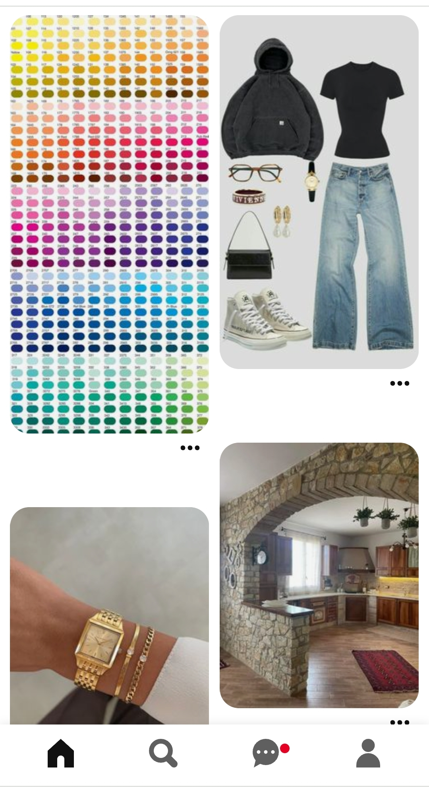
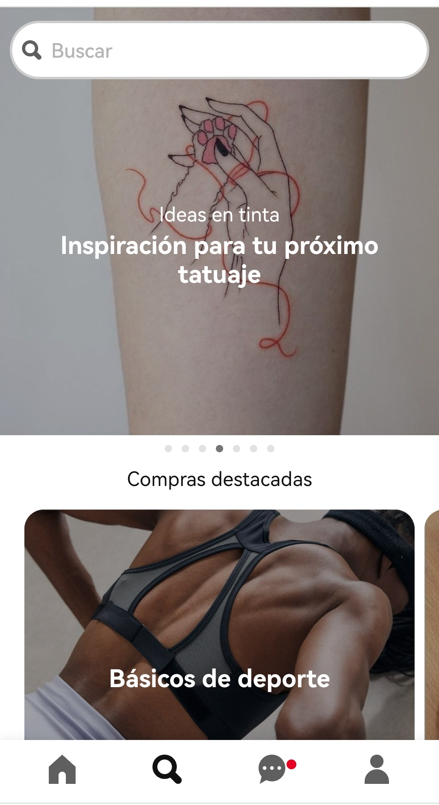

# Async web design - Proyecto 3 - Réplica de la página Pinterest

## Descripción

Para el proyecto he replicado la página Pinterest en su versión movil, tablet y escritorio.

Pinterest no tiene un footer visible como tal en ninguna de estas versiones, por ello,
cuando en el proyecto me refiero al footer, me estoy refiriendo en realidad al menú principal; que en su versión móvil y tablet se sitúa en la zona donde estaría el footer.

Los estilos generales de la estructura principal están en style.css. Sólo en algunos componentes he asignado algunos estilos concretos.

En FOOTER-SPECIAL, están los accesos, ahora mismo útiles, del menú en movil y tablet (inicio y lupa).

En la versión movil y tablet, el input de búsqueda no se muestra; aparece al darle a la lupa.

Para ello he creado la smartphoneSearchBar, que se abre al pulsar la lupa y he importado la función searchInfo a la misma. Aquí, especifico que voy a abrir 5 páginas de las 50 que permitía Unsplash, sólo por probar.

Espero vuestra corrección !! 😅 Un saludo!!

Alumna: María Rivas
